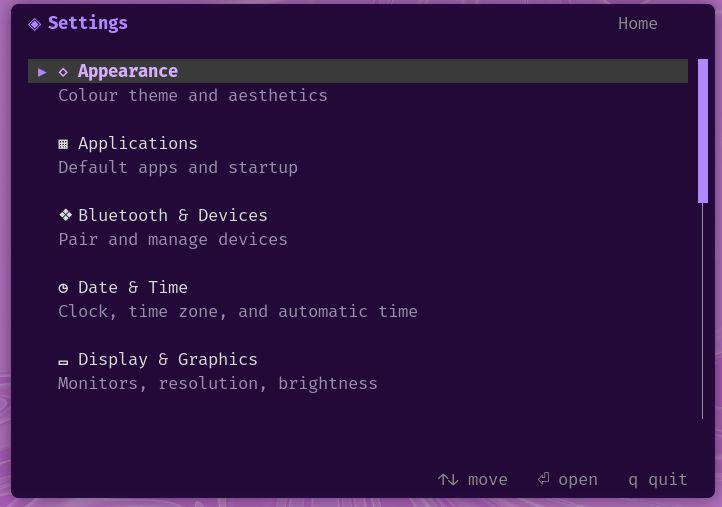
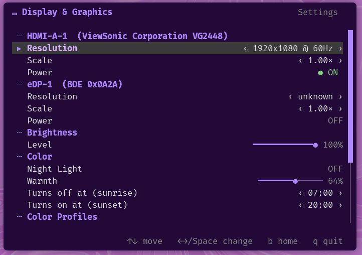
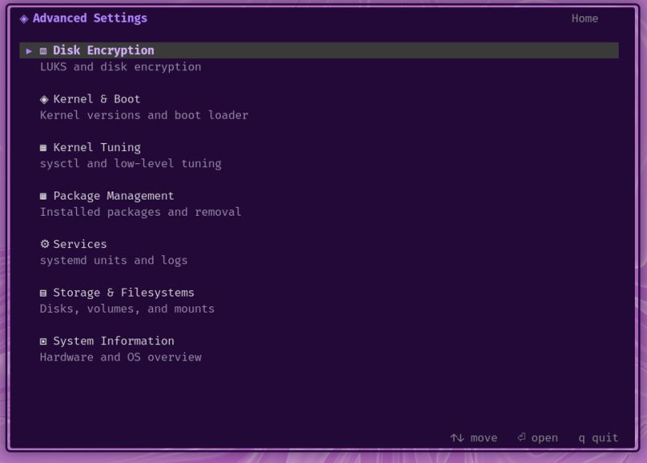
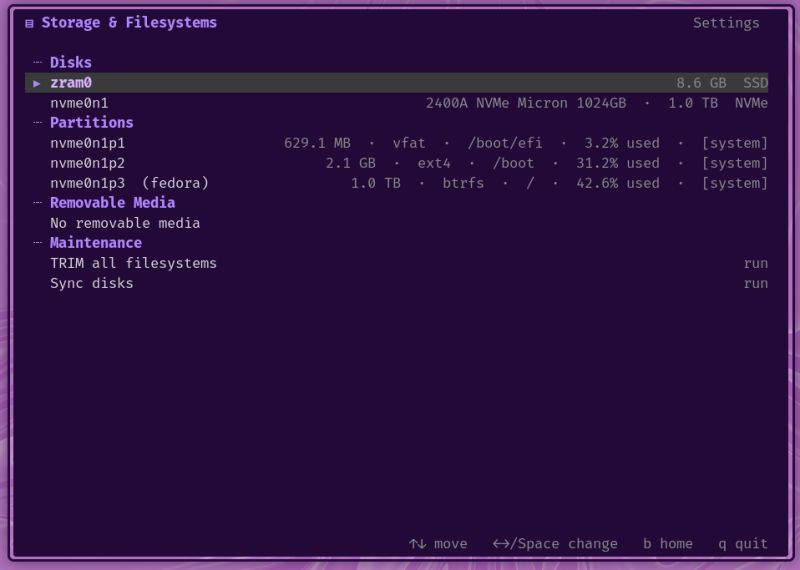

# Settings Menu — pure-Lua terminal settings manager

A zero-dependency terminal (TUI) settings manager for Linux, built for a
**Sway / Wayland** desktop. Two apps — everyday desktop settings and system
administration — rendered as flicker-free, keyboard- and mouse-driven menus in
pure Lua with no external libraries.

    lua app1.lua     # General Settings  (desktop & personal)
    lua app2.lua     # Advanced Settings (advanced / root)

Home menu: vertical list, alphabetical. Up/down (or `j`/`k`, or mouse wheel) to
move, Enter to open, `q` to quit, `b` back. Mouse: single-click selects,
double-click opens.

Images for the general settings
<p align="center">
  
</p>
<p align="center">
  
</p>

Images for the advanced settings
<p align="center">
  
</p>

<p align="center">
  
</p>

> **Naming note.** The project is *Settings Menu*. Its on-disk locations keep the
> original `tui-settings` slug — the program directory (`/opt/tui-settings`) and
> the config directory (`~/.config/tui-settings/`) — so existing installs and
> saved settings are never disturbed by the rename.

---

## Design principles

- **Zero dependencies.** Pure Lua 5.4 and the standard library only. No luarocks,
  no C extensions. Config parsing, JSON decoding, and rendering are all hand-rolled.
- **Live and honest.** Settings apply immediately where the OS allows it; where a
  setting can't be applied live or safely, it is shown read-only or omitted
  rather than faked.
- **Flicker-free.** Categories load in-process (no subprocess spawn per screen);
  the draw loop is dirty-gated, so an idle screen does no work.
- **Safe by construction.** All shell execution goes through one audited helper
  (`util.lua`) with argument-level quoting, so untrusted input (Wi-Fi SSIDs,
  usernames) cannot be shell-injected. Privileged actions run via `pkexec`/polkit;
  the app never handles root passwords itself.
- **Portable across Sway systems.** Anything that differs between distros
  (package manager, firewall, network stack) sits behind a swappable *provider*
  chosen at runtime; anything universal is a documented prerequisite.

---

## Architecture

The codebase splits into five roles:

- **Launchers** (`app1.lua`, `app2.lua`) — register categories and run the home menu.
- **Shared infrastructure** — rendering, utilities, environment detection, and
  the provider/capability machinery used across the app.
- **Providers** — swappable subsystems (package manager, firewall, network,
  theme) that pick a concrete implementation at runtime via environment detection.
- **Categories** (`a1_*`, `a2_*`) — one settings screen each; hold the UI layout,
  delegate all work to a backend.
- **Backends** (`*_backend.lua`) — talk to the OS and command-line tools; hold
  no UI.

### Providers and portability

Subsystems that legitimately differ between Sway systems are abstracted behind a
sealed provider (`provider.lua`), which selects a driver based on what's
installed. Each driver fully owns its own tool and command syntax; categories
call a stable interface and never see which implementation answered.

| Subsystem | Implementations |
| --------- | --------------- |
| Package manager | dnf, apt, pacman, zypper, apk |
| Firewall | firewalld, ufw, nftables |
| Network | NetworkManager (nmcli), iwd (iwctl) |
| Theme | default, terminal, presets, custom |

`capability.lua` turns environment detection into per-category support verdicts:
a category that can't work on the current system (e.g. Services on a non-systemd
box) shows a clear banner explaining why, instead of an empty or broken panel.

---

## Categories

**App 1 — General Settings (13):** Network, Bluetooth & Devices,
Display & Graphics, Mouse & Touchpad, Sound, Power, Notifications,
Privacy & Security, Applications, Users & Accounts, Region & Language,
Date & Time, Appearance.

**App 2 — Advanced Settings (7):** Package Management, System Information,
Kernel & Boot, Kernel Tuning, Services, Storage & Filesystems, Disk Encryption.

### Root actions (via pkexec / polkit — needs an agent such as lxpolkit)

- **Date & Time** — timezone, automatic-time (NTP) toggle
- **Region & Language** — locale / keymap
- **Users & Accounts** — add / delete / lock / unlock / change password
- **Privacy & Security** — firewall enable/disable; clear system logs
- **Package Management** — uninstall packages
- **Kernel Tuning** — persist curated sysctls
- **Services** — start/stop/enable/disable units, vacuum journal
- **Disk Encryption** — open/close LUKS volumes, manage key slots
- **Kernel & Boot** — rebuild initramfs

### Appearance (theming)

Foreground colour theming (text and accents; the terminal's own background is
untouched). Choose from **default** (purple), **terminal** (inherit the
terminal's ANSI colours), the presets **nord / gruvbox / dracula / catppuccin**,
or **custom** RGB via `~/.config/tui-settings/theme.conf`. An empty, missing, or
broken theme file falls back to the default automatically.

---

## Requirements

**Universal (assumed present on any Sway system):** Lua 5.4, `swaymsg`,
`cryptsetup`, `lsblk`, `udisksctl`, PipeWire/Pulse (`wpctl`/`pactl`),
`brightnessctl`, `wlsunset`, `sysctl`. A polkit agent (e.g. `lxpolkit`) is
needed for root actions.

**Swappable (any one of each works):** a package manager, a firewall, and a
Wi-Fi backend from the tables above. Where none is present, the relevant
category degrades with an explanatory banner rather than failing.

---

## File tree — the program

```
/opt/tui-settings/          (51 Lua files)
│
├── LAUNCHERS (entry points)
│   ├── app1.lua ................ General Settings (13 categories)
│   └── app2.lua ................ Advanced Settings (7 categories)
│
├── SHARED INFRASTRUCTURE (required by many files)
│   ├── core.lua ............... rendering, widgets, dialogs; builds M.C palette
│   ├── util.lua ............... safe shell/run, quoting, json, file helpers
│   ├── env.lua ................ detects distro / init / compositor / audio
│   ├── capability.lua ........ per-category "is this supported here?" verdicts
│   ├── provider.lua .......... sealed driver-selection for swappable subsystems
│   └── event_cache.lua ....... event-driven backend refresh helper
│
├── PROVIDERS (polymorphic — pick a driver at runtime)
│   ├── pkgmanager.lua ........ dnf / apt / pacman / zypper / apk
│   ├── firewall.lua .......... firewalld / ufw / nftables
│   ├── network.lua ........... NetworkManager (nmcli) / iwd (iwctl)
│   └── theme.lua ............. default / terminal / presets / custom colours
│
├── CATEGORIES — App 1  (each returns {category, run})
│   ├── a1_appearance.lua ....... → theme.lua
│   ├── a1_applications.lua ..... → applications_backend.lua
│   ├── a1_bluetooth.lua ........ → bluetooth_backend.lua
│   ├── a1_datetime.lua ......... → datetime_backend.lua
│   ├── a1_display.lua .......... → display_backend.lua
│   ├── a1_input.lua ............ → input_backend.lua
│   ├── a1_network.lua .......... → network_backend.lua → network.lua
│   ├── a1_networkpass.lua ...... (helper: Wi-Fi password prompt, not a category)
│   ├── a1_notifications.lua .... → notifications_backend.lua
│   ├── a1_power.lua ............ → power_backend.lua
│   ├── a1_privacy.lua .......... → privacy_backend.lua → firewall.lua
│   ├── a1_region.lua ........... → region_users_backend.lua
│   ├── a1_sound.lua ............ → audio_backend.lua
│   └── a1_users.lua ............ → region_users_backend.lua
│
├── CATEGORIES — App 2
│   ├── a2_encryption.lua ....... → encryption_backend.lua
│   ├── a2_kernel_boot.lua ...... → kernel_boot_backend.lua
│   ├── a2_kernel_tuning.lua .... → kernel_tuning_backend.lua
│   ├── a2_packagemgmt.lua ...... → applications_backend + pkgmanager.lua
│   ├── a2_services.lua ......... → services_backend.lua
│   ├── a2_storage.lua .......... → storage_backend.lua
│   └── a2_sysinfo.lua .......... → sysinfo_backend.lua
│
└── BACKENDS (talk to the OS/tools; hold no UI)
    ├── applications_backend.lua      ├── network_backend.lua
    ├── audio_backend.lua             ├── notifications_backend.lua
    ├── bluetooth_backend.lua         ├── power_backend.lua
    ├── datetime_backend.lua          ├── privacy_backend.lua
    ├── display_backend.lua           ├── proxy_backend.lua
    ├── encryption_backend.lua        ├── region_users_backend.lua
    ├── input_backend.lua             ├── services_backend.lua
    ├── kernel_boot_backend.lua       ├── storage_backend.lua
    ├── kernel_tuning_backend.lua     └── sysinfo_backend.lua
```

## File tree — user data

The app owns exactly two config files, both optional (absent = use defaults),
both plain `key = value` text:

```
~/.config/tui-settings/
├── theme.conf ......... colour choice + optional custom RGB
│                        (written by Appearance; hand-editable)
└── nightlight.conf .... night-light temperature + schedule
                         (written by Display → night light)
```

### Config files the app touches but does not own

Written to the OS's own locations (one source of truth), not duplicated in home:

```
SYSTEM configs the app WRITES (via pkexec):
  /etc/sysctl.d/99-tui.conf ........... persisted kernel tuning     (Kernel Tuning)

SYSTEM configs the app READS (to display state):
  /etc/os-release ..................... distro detection            (env.lua)
  /etc/dnf/protected.d/*.conf ......... protected packages          (pkgmanager)
  /etc/modprobe.d/*.conf .............. blacklisted modules         (kernel_boot)
  /etc/systemd/journald.conf .......... journal settings            (services)

OTHER-APP configs the app reads/writes:
  ~/.config/kanshi/config ............. display arrangement         (display_backend)
```
